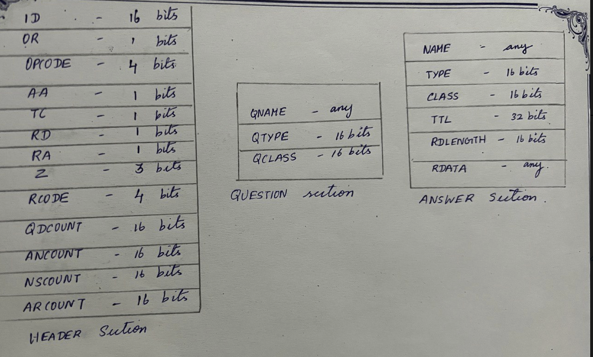
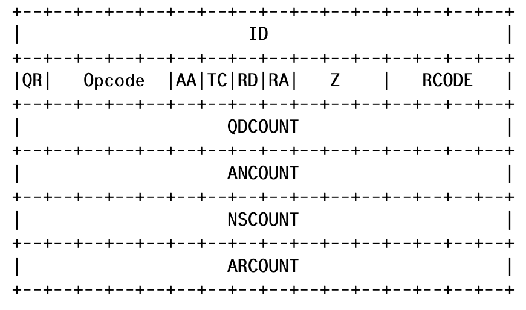

# Authoritative Server.

A simple Authoritative Server for a domain name using poll.  

## usage

Test the program using dig command:
    dig @127.0.0.1 -p 53 www.everus.com

# DNS packet structure

All DNS packets have five segments. The are
1. Header
2. Question
3. Answer
4. Authority
5. Additional

Size of fields of Header, Question and Answer sections:

## Encoding and Decoding bit-size fields of header:

Encoding and Decoding QR field to demonstrate the idea. 

Decoding QR field: QR field in header has size one bit. The OR field is located in the first bit of the packet after ID field.
Get the next 16 bits after ID field using get_16bits() function and store it in a uint32_t variable flags(say). 

Create a masK: uint16_t QR_MASK = 0x8000.
Hex 0x8000, of type uint16_t is 1000 0000 0000 0000 in binary. To get the first bit of the 16 bit number do, (flags & QR_MASK ).

If QR = 1 then flags & QR_MASK = 1000 0000 0000 0000.
If QR = 0 then flags & QR_MASK = 0000 0000 0000 0000.

The >> operator shifts the bits to the right. We have 15 empty bits to the right so we shift right 15 times.

If QR = 1 then (flags & QR_MASK) >> 15 = 0000 0000 0000 0001.
If QR = 0 then (flags & QR_MASK) >> 15 = 0000 0000 0000 0000.

Encoding QR field: 

Get the QR value from the struct. In this program its r_packet->r_header->qr. It is 1 or 0. In 16 bit binary it is 0000 0000 0000 0001 or 0000 0000 0000 0000. Since the QR field is the first bit in the header after ID we shift it bitwise left using << we get either 1000 0000 0000 0000 or 0000 0000 0000 0000. Then we perfor biwise and operation with QR_MASK, to make sure rest bits are indeed zero.